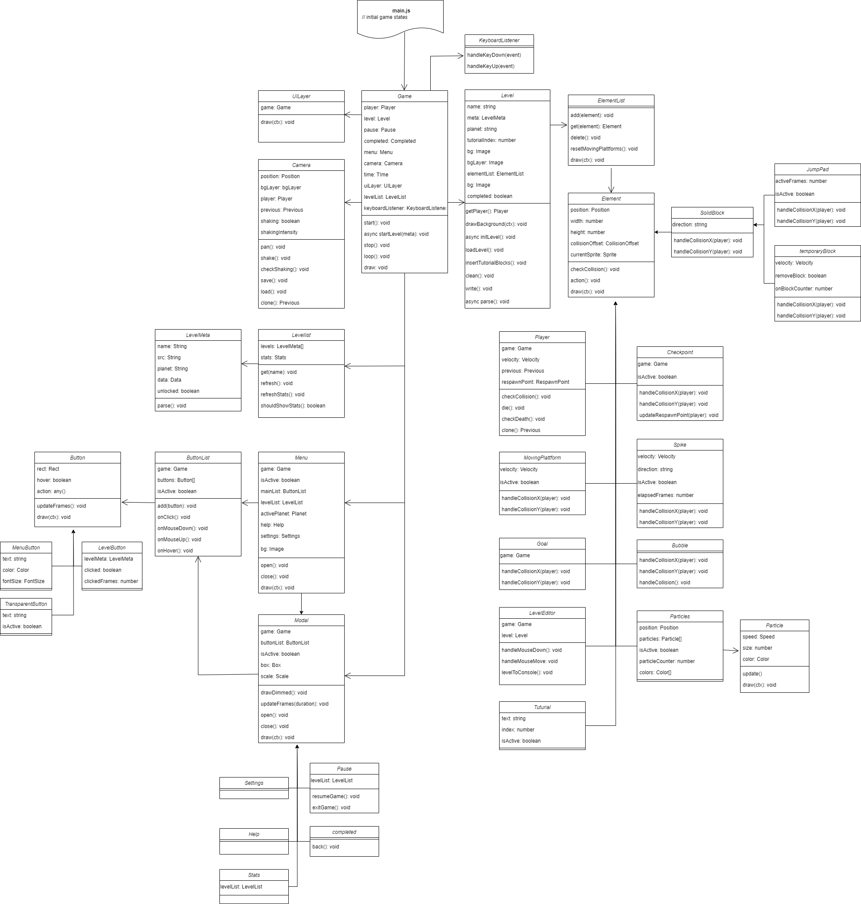

# Celestial

## Overview
Celestial is a space-themed precision platformer inspired by the indie game Celeste. Navigate through challenging cosmic environments using precise movement mechanics like dashing and wall jumping. This project was developed as a university assignment.

## Game Features
- **Core Mechanics:**
  - Precise dashing system
  - Wall jumping
- **Level Elements:**
  - Moving platforms
  - Jump pads
  - Deadly spikes
  - Collectable coins that reset your dash ability
- **Original Audio:**
  - Custom soundtrack
  - Handcrafted sound effects

## Controls
- **Arrow Keys** - Movement
- **Space** - Jump
- **Shift** - Dash
- **D** - Dance
- **ESC** - Pause game

## Development
Celestial was developed as a university project, focusing on:
- Implementation of precision platformer mechanics
- Level design that gradually introduces new challenges
- Audio design and implementation
- Game feel and responsive controls

## Technical Details
Celestial is built with:
- Vanilla JavaScript
- HTML5
- JavaScript Canvas API for all game rendering and UI elements
- Bundled with Vite

## Architecture

## Installation
1. Clone this repository
2. Install dependencies with `npm install`
3. Run the development server with `npm run dev`
4. Build for production with `npm run build`
---
*Celestial is a student project inspired by Celeste, created by Matt Makes Games.*
